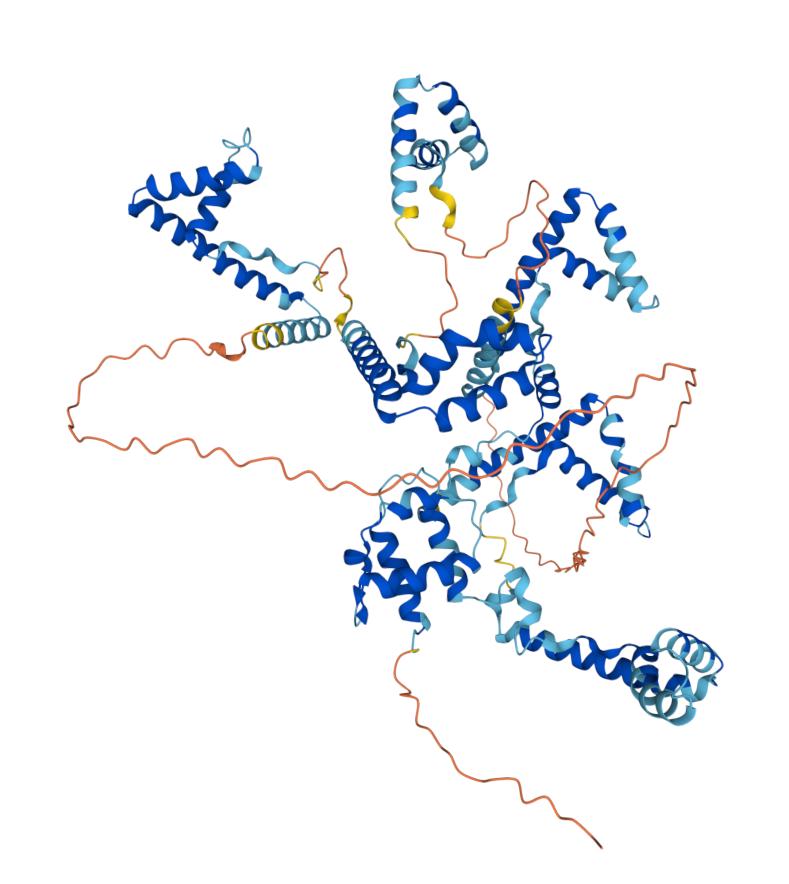
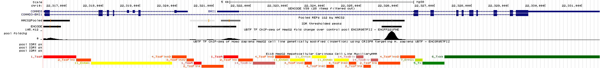
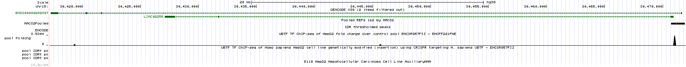
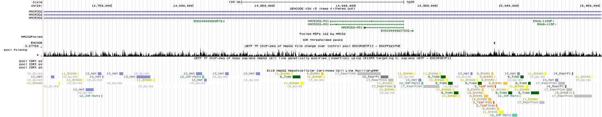
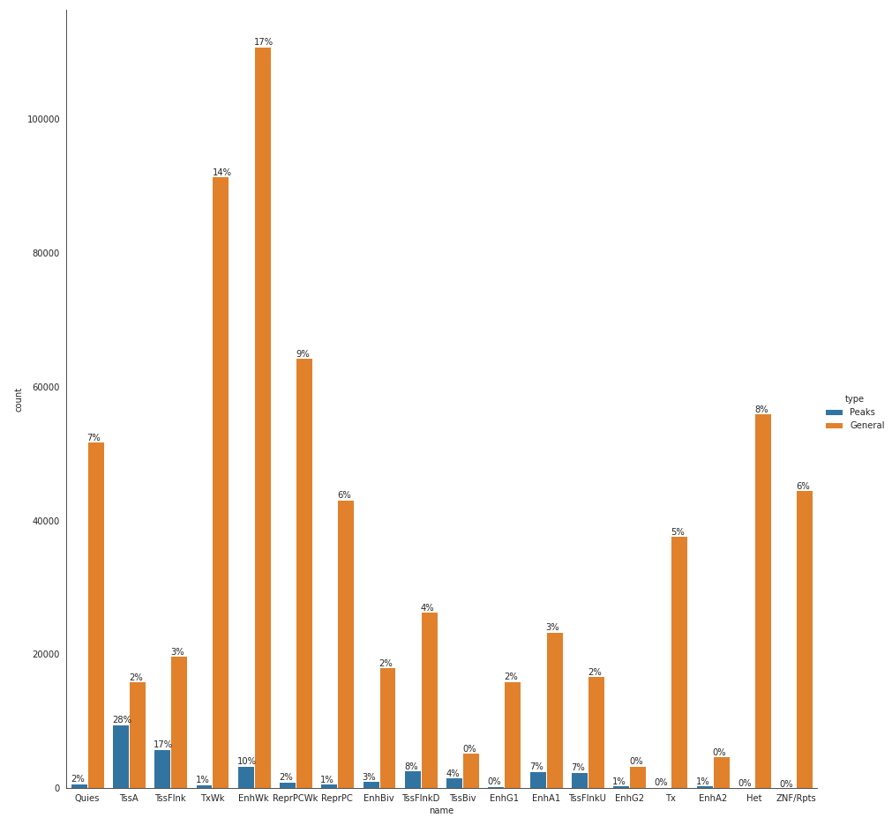

# BCG

This gene encodes a member of the HMG-box DNA-binding protein family. The encoded protein plays a critical role in ribosomal RNA transcription as a key component of the pre-initiation complex, mediating the recruitment of RNA polymerase I to rDNA promoter regions. The encoded protein may also play important roles in chromatin remodeling and pre-rRNA processing, and its activity is regulated by both phosphorylation and acetylation. Alternatively spliced transcript variants encoding multiple isoforms have been observed for this gene. Pseudogenes of this gene are located on the short arm of chromosomes 3, 11 and X and the long arm of chromosome 11.

UBF belongs to the sequence nonspecific class of HMG (high mobility group) proteins. It has six HMG-box homology domains and has been proposed to interact with rDNA as a dimer and to induce six in-phase bends to generate a single 360-loop structure that resembles the nucleosome.

Controls: ENCSR730QNM

ENCSR957FIZ - ChIP-seq (TF ChIP-seq) experiment, with UBTF target.
Contains 2 isogenic replicants,  

Biosample summary: Homo sapiens HepG2 genetically modified (insertion) using CRISPR targeting H. sapiens UBTF. Sonication fragmentation methods was used.  

Both enrichment and control experiments were performed on Illumina NovaSeq 6000 platform with 100bp read length each, further data processing performed via ENCODE4 v1.4.0 GRCh38 pipeline.

Mild to moderate bottlenecking of ChIP-seq assays is mentioned by Library Complexity Audits, measured using PCR Bottlenecking Coefficients 1 and 2 (PBC1 and PBC2)

No information related to UBTF is presented on JASPAR

| Sourse   |      # Total  |  # Mapped     |   % M/T       |    # Mapped Unique | 100% * (#M - #MU) / #M |   PBC1        |   PBC2       |
|----------|:-------------:|:-------------:|:-------------:|:------------------:|:----------------------:|:-------------:|-------------:|
| REP1     |  42193238     | 38623136      | 91.54%        |    28178721        |  27.04%                |   PBC1        |   PBC2       |
| REP2     |    50499425   |   39470960    | 78.16%        |    22805590        |  42.22%                |   PBC1        |   PBC2       |
| CONTROL  |    57619090   |   48631054    | 84.40%        |    32853680        |  32.44%                |   PBC1        |   PBC2       |

| Sourse   | Redundant Rate   |  Estimated Fragment Size (d) |
|----------|:----------------:|-----------------------------:|
| REP1     |  13%             |  171 BPs                     | 
| REP2     |  26%             |  156 BPs                     |

# Intersections

| Sourse      |  #Peaks       | #Peaks intersected \w Encode  | #Peaks summit overlap \w Encode (150 pb window) |
|-------------|:-------------:|:-----------------------------:|:-----------------------------|
| REP1        |   51771       |         24246                 |         20741            | 
| REP2        |   40667       |         21897                 |         19270            |
| REP1 & REP2 |   37379       |         22019                 |         -                |
| POOLED      |   37379       |         22441                 |         20121            |
| ENCODE      |   37951       |         -                     |         -                |

# Peaks summit overlap \w 150bp window

# IDR

Prior to estimate the IDR, peaks calling shall be re-computed with relaxed thresholds.

| Sourse      |  #Peaks       | #Peaks after BlackList  |
|-------------|:-------------:|:------------------------|
| REP1        |   129911      |         129905          |
| REP2        |   88074       |         88054           |

REP1 & REP2 peaks overlap resulted in 48857 summits,  
Number of peaks passing IDR cutoff of 0.2 - 23649/48857
IDR .2 THRESHOLDED overlap with ENCODE: 26864 peaks in common.

# Visualisation UCSC Genome Browser

The most enriched peaks found by both this project and ENCODE.

The most enriched peaks found by this project only.

The most enriched peaks found by ENCODE only.

# ChHMM

# Pscan-ChIP

# SeqMiner
| H3K27ac | H3K4me3 | TBP | H3K9me3 |

# DNase-Seq
| DNase-Seq & REPS |  #Peaks       |
|------------------|:--------------|
| OVERLAPPED       |   27148       |
| NON              |   10230       |

# Great
The test set of 37,378 genomic regions picked 14,066 (75%) of all 18,777 genes.
